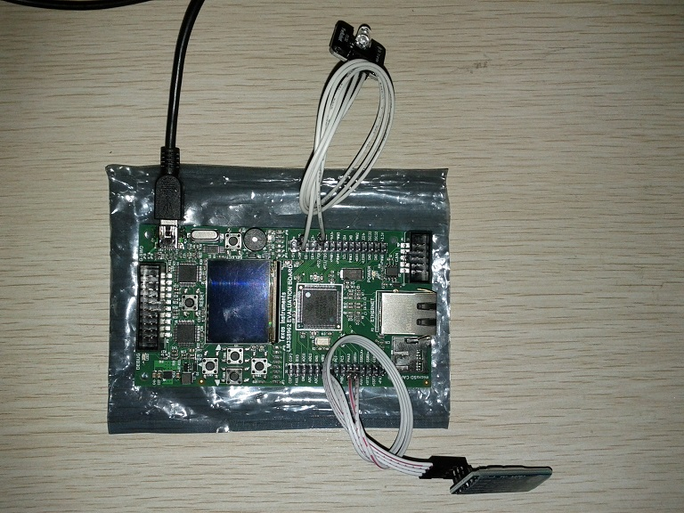
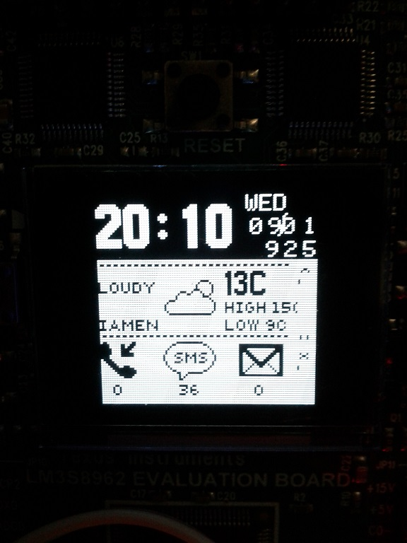
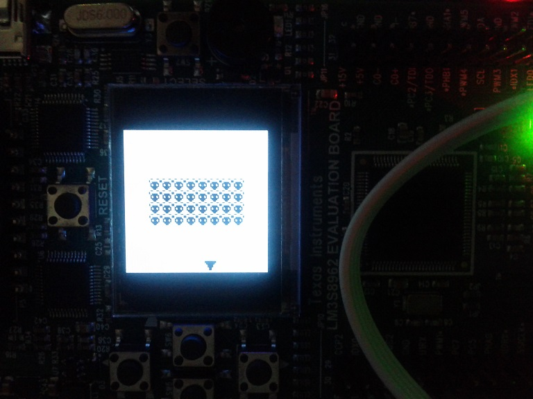

# Watch: 可穿戴设备--智能手表
---
## 说明
12年不知道从哪弄到了一块TI的lm3s8962开发板，上面带了块小小的液晶屏。当时穿戴设备正火，自己好像也正在休假，于是就用它开发了个智能手表的原型。  
  
lm3s8962 evb长成这样子：  

## 功能
手机通过蓝牙与手表（开发板）相连，手表接收手机讯息后，将它展示给用户；用户做出反馈，手表将反馈信号传回手机，总之就是一个简单的智能手表原型机。手表能显示来电、短信、天气、时间，还能玩点小游戏。  
lm3s8962运行FreeRTOS，手机端app基于android。这是个完整的系统，从硬件、操作系统 、通讯协议、再到上层应用。作为业余爱好，开发这么个系统还是挺有意思的，黑白屏总让我想起小时候带的电子表:)。  
  
这是系统启动之后的样子，上面显示当时厦门的天气是多云，有36条短信未读（怎么这么多。。。）：  
  
  
这是一个小游戏：  
  

## 代码  
代码包括设备端与手机端两部分，都在Src目录下。手机端代码是在google nexus s上测试的。